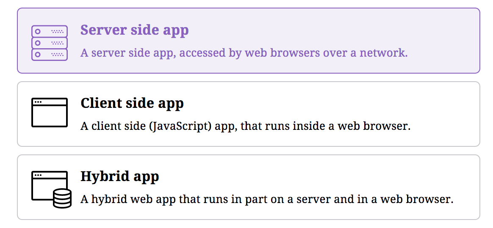
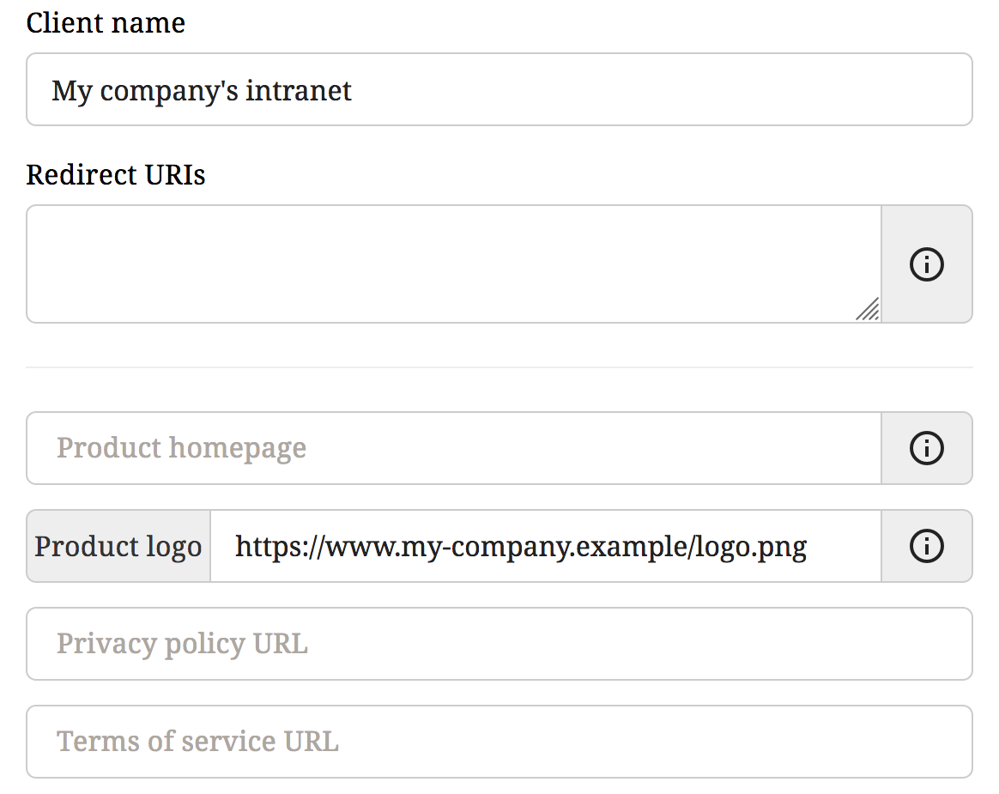

Learn how to get started with Authentiq in minutes by following these simple steps:

1. [Register your app](#step-1-register-your-app)
2. [Choose your framework](#step-2-integrate-your-app)
3. [Enable extra features](#step-3-extra-features)

# Step 1: Register your app

The first step to integrating Authentiq Connect in your project is to register the application.

- Sign in to the [Authentiq Dashboard](https://dashboard.authentiq.com/).
- Click **Add your first application**.
- Select the appropriate type for your app, [see here](faq.md#application-types) if unsure what to choose.
  {:class="img-responsive img-thumbnail m-3 text-left"}
- Give your app a descriptive name in the **Client name** field.
  {:class="img-responsive m-3 text-left"}
  You can leave the **Redirect URIs** field empty while testing.
- If you can, provide a logo for your project.
- Save your app.
- Make note of the **Client ID** and **Client Secret**.

# Step 2: Integrate your app

With the client credentials you obtained above at hand, you are ready to integrate Authentiq in your app. There are several ways to do this.

**Integration option** | **When to use**
:--------------------- | :--------------
[OpenID Connect](#using-openid-connect-or-oauth-20) | When your framework supports OIDC.
OAuth 2.0 | When your framework supports OAuth 2.0, but not OIDC.
Authentiq JS | To add a customized button to your site.
Authentiq Proxy | To protect any backend website (such as a CI server) with Authentiq.

Choosing the right integration depends on your situation. Read more about the individual options below, or feel free to [chat with us online](https://dashboard.authentiq.com/?utm_source=docs&utm_medium=docs&utm_campaign=get-started-chat){:target="_blank"} if unsure what option to pick.

## Using OIDC or OAuth 2.0

In case your website framework supports OpenID Connect (natively or via an add-on), then it's often best to use that. [Many frameworks](index.md#integrations) either have built-in or pluggable support for OIDC and allow you to connect to an external provider. Some even support single sign-on and logout.

When no OIDC support is available it is usually possible to fall back to OAuth 2.0.

Here are the configuration parameters you will need.

**Parameter** | **Value**
--------------| ---------
Configuration Endpoint | `https://connect.authentiq.io/.well-known/openid-configuration`
JWK Set Endpoint | `https://connect.authentiq.io/public-keys`
Authorization Endpoint | `https://connect.authentiq.io/authorize`
Token Endpoint | `https://connect.authentiq.io/token`
UserInfo Endpoint | `https://connect.authentiq.io/userinfo`
Scope | `openid profile email~r aq:locale aq:zoneinfo aq:push` (see [scopes](index.md#identity-scopes))

## Using Authentiq JS

Coming soon!

## Using a proxy

Some applications, such as certain DevOps or intranet tools, may not natively support OIDC or OAuth 2.0 out of the box. A good option in this case is to let a simple proxy server handle the authentication for you, protecting any application behind it.

Authentiq works well with both Nginx and Apache webservers in this scenario, and you'll find an example of protecting a Jenkins CI server with Nginx [here](https://github.com/AuthentiqID/authentiq-proxy/tree/master/jenkins). 

# Step 3: Extra features
 
## The ID Token

### Claims

After signing in a user, Authentiq will provide your app with an ID Token containing one or more [identity claims](index.md#identity-scopes). For example:

```json
{
  "iss": "https://connect.authentiq.io/",
  "sub": "user-identifier-4893-aee5-e404d14db230",
  "aud": ["your-client-id-8d95-48ea2f9b146c"],
  "azp": "your-client-id-8d95-48ea2f9b146c",

  "name": "Alice Smith",
  "given_name": "Alice",
  "family_name": "Smith",

  "email": "alice@authentiq.com",
  "email_verified": true,

  "phone_number": "+441234567890",
  "phone_number_verified": true,
  "phone_type": "mobile",

  "aq:location": {
    "address": {
      "street_address": "40 Islington High St, London, UK",
      "state": "England",
      "postal_code": "N1 8XB",
      "country": "United Kingdom",
      "formatted": "40 Islington High St, London, UK\nN1 8XB\nEngland\nUnited Kingdom"
    },
    "latitude": 51.5330282,
    "longitude": -0.1052847,
    "accuracy": 13.743
  },

  "locale": "en-GB",
  "zoneinfo": "Europe/London",

  "exp": 1537969601,
  "iat": 1537966001,
  "nbf": 1537966001,

  "scope": "aq:name email phone aq:location aq:locale aq:zoneinfo",

  "jti": "4s54os4Ip_e6aQSqetwr8Q",
  "nonce": "25141300354380601671537965988",
}
```

### Signature

When authenticating via Authentiq your app will receive an ID Token containing the user's details. This is a JWT that can either be unsigned (when obtained from the Token Endpoint using the client's credentials), or signed with an RSA signature (in JavaScript, hybrid or public flows).

In the former case there is no need to verify the ID Token signature, as long as you correctly verify the TLS certificate to the Token Endpoint. Your HTTP client would normally do this.

When not receiving the ID Token from the Token Endpoint, it is your responsibility to verify the token's RSA signature. You can find how to do this in the [OIDC Specification](https://openid.net/specs/openid-connect-core-1_0.html#ImplicitIDTValidation). The Authentiq Connect JWK Set can be found [here](https://connect.authentiq.io/public-keys).

## Enabling remote sign out

Authentiq supports two methods to enable a user to sign out from your application remotely, from their Authentiq ID. Both methods are based on OpenID Connect.

### Session Management

The first is a using [OIDC Session Management](https://openid.net/specs/openid-connect-session-1_0.html) and is automatically supported when using AuthentiqJS.

When not using AuthentiqJS, you can write your own RP iframe and load our OP iframe into your page. The OP iframe can be found from our [Configuration Endpoint's](https://connect.authentiq.io/.well-known/openid-configuration) `check_session_iframe` key.

### Back-Channel Logout

The second method is based on [OIDC Back-Channel Logout](https://openid.net/specs/openid-connect-backchannel-1_0.html), and allows you to configure an endpoint on your application we should call out to. Once you have created a back-channel logout endpoint according to the OIDC specification, sign into the Dashboard and enter its URL in the **Backchannel Logout URL** field under *Advanced options* for your client.

