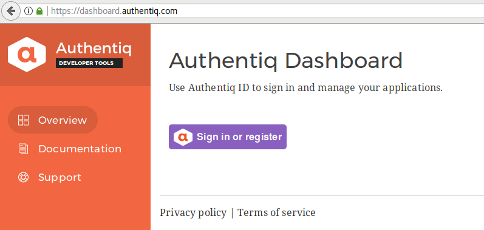
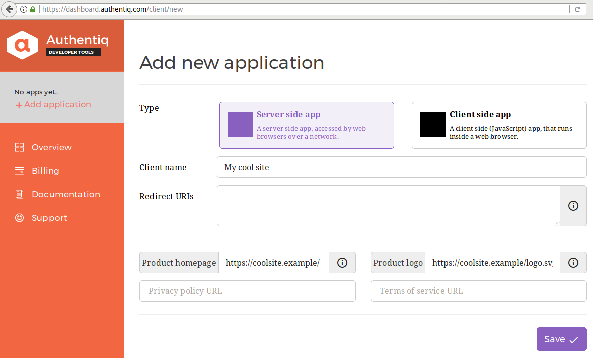
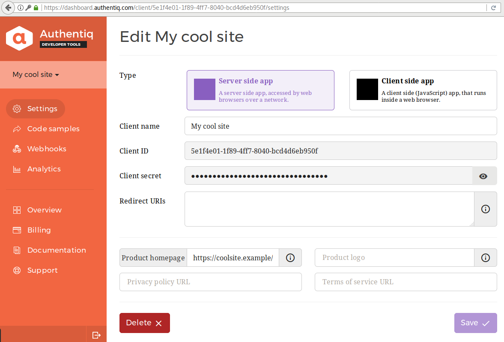
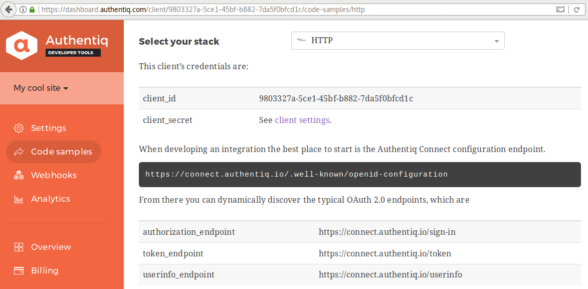

one_level_toc: true

This use case describes how to set up Authentiq for email-based passwordless authentication.

# Benefits

These steps will let users:

- Sign in to your application when they don't have their password at hand.
- Sign in quicker and more conveniently on repeated visits.
- Avoid shoulder surfing and key loggers on public computers.
- Sign out from their mobile phone (if implemented).
- Sign up without filling out a registration form.

# Who should use this

Follow this guide when an email-based security level is appropriate, or as a starting point for [multi-factor authentication](replace-two-step-verification.md).

*[email-based security level]: A level of security commonly found with websites, where the main account recovery mechanism is based on having access to the registered email address.

# How it works

When users sign in with Authentiq ID, they share a verified email address that can be used to sign in an existing user, or register someone new. The mechanism provides the same security level as a "Forgot password?" option that recovers accounts via email.

> See [multi-factor authentication](replace-two-step-verification.md) on how to go from here to higher security.

# Recipe

Enable users to sign in with Authentiq ID in just four steps.

## Register a new application in Authentiq

Visit the [Authentiq Dashboard](https://dashboard.authentiq.com/) and sign in with Authentiq by clicking “Sign in or register”.



Then create a new application by clicking “Add your first application”.



Now select “Server side app” and fill out the details. Note that for a test drive you can leave the *Redirect URIs* field empty. In fact, only the Client name field is mandatory, although we recommend to add a link to an (approximately square) logo to personalize the sign in experience.



Make a note of the Client ID and Secret once created.

## Connect Authentiq to your application

### Find an OAuth 2.0 client library

> If your application already connects to other OAuth 2.0 or OIDC providers, then you can skip this step.

Check if there is a Code Sample available for your stack in the [Dashboard](https://dashboard.authentiq.com/) or on [GitHub](https://github.com/AuthentiqID).



Otherwise, find the most appropriate [OAuth 2.0 library](https://oauth.net/code/) or [OIDC library](http://openid.net/developers/certified/#RPLibs) for your situation. Authentiq works with either.

### Configure the library

Use the following parameters together with the Client ID and Client Secret copied above to configure your OAuth 2.0 client library.

| | |
|-----|---|
| Scope | openid name email~rs |
| Configuration Endpoint | https://connect.authentiq.io/.well-known/openid-configuration |
| Authorization Endpoint | https://connect.authentiq.io/authorize |
| Token Endpoint | https://connect.authentiq.io/token |
| Userinfo Endpoint | https://connect.authentiq.io/userinfo |

Authentiq returns the user's profile in a format compatible with OpenID Connect, both in the ID Token and from the UserInfo endpoint.

```json
{
   "sub" : "11bd3ad2-4717-5b74-ac16-a2bc14251162",
   "iss" : "https://connect.authentiq.io/",
   "aud" : "<client_id>",
   "sid" : "00c77b86-c83b-4d63-9bb7-11c144a48565",
   "iat" : 1449705600,
   "exp" : 1449706200,

   "name" : "Ada Lovelace",
   "given_name" : "Augusta",
   "middle_name" : "Ada",
   "family_name" : "Byron",
   "phone_type" : "mobile",
   "phone_number" : "+44123456789",
   "phone_number_verified" : true
   "email" : "ada@lovelace.example",
   "email_verified" : true,
}
```

Note that next to the `name` field, the profile may also contain `given_name`, `family_name` and `middle_name`, which can be used to populate the user record in the database.


### Add Authentiq "Sign in" button to login form

- Use AuthentiqJS
- Or custom and point to: `/authorize?...`

### Verify email address

- If email exists in database, log in that user.
- If email doesn't exist in database, register new user.

[TODO]

# Next steps

Congratulations! Your users can now sign in without a password, based on a verified email address, and avoid typing their passwords . Continue reading to learn how to [increase the security level to that offered by two-step verification](replace-two-step-verification.md).

Have a question? [Get in touch](mailto:ask@authentiq.com)! Have a suggestion? Edit this page!
